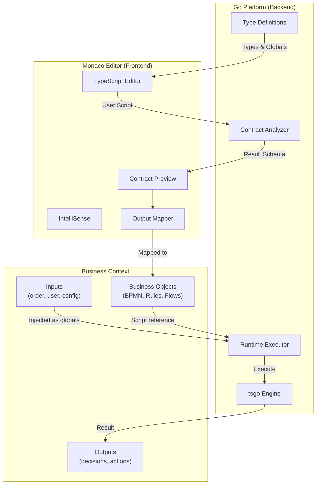

# tsgo

A secure TypeScript execution library for Go with multiple execution engines.

## Use Case: User-Defined Business Logic

tsgo enables **platforms** built in Go to safely execute **user-defined TypeScript** for customizable business logic — workflow conditions, automation handlers, data transformations, and more.



### How It Works

1. **Platform defines context** — The Go backend registers typed globals (e.g., `order: Order`, `user: User`) and interfaces that scripts can use
2. **User writes logic** — In the Monaco editor with full IntelliSense, autocomplete, and type checking powered by the platform's type definitions
3. **Contract extraction** — As the user types, the system analyzes the script and generates a contract (TypeScript types + JSON Schema) for the return value
4. **Output mapping** — The user maps the script's output to business objects (e.g., "route to → approval workflow", "set priority → field")
5. **Runtime execution** — When triggered, the Go backend executes the script with real data, returning typed, validated results

### Example: Order Routing Handler

```typescript
// Platform provides: order, customer, config (with full types)
const totalValue = order.items.reduce((sum, item) => sum + item.price * item.quantity, 0);
const isVIP = customer.tier === 'platinum' || customer.totalSpent > 100000;

// Business logic in TypeScript
const needsApproval = totalValue > config.approvalThreshold && !isVIP;
const priority = isVIP ? 'high' : totalValue > 10000 ? 'medium' : 'normal';

export default {
  route: needsApproval ? 'approval-workflow' : 'fulfillment',
  priority,
  flags: {
    vipCustomer: isVIP,
    largeOrder: totalValue > 10000,
  }
};
```

**Generated Contract:**
```typescript
export type Result = {
  route: string;
  priority: string;
  flags: { vipCustomer: boolean; largeOrder: boolean };
};
```

The platform can then map `route` to a workflow selector, `priority` to a queue, and `flags` to audit fields — all with type safety and validation.

### Benefits

- **Type Safety** — Full TypeScript with platform-defined types eliminates runtime surprises
- **Great UX** — Monaco editor with IntelliSense gives users IDE-quality editing
- **Contract-Driven** — Output schemas enable visual mapping and validation before deployment
- **Secure Execution** — Sandboxed runtime with controlled globals, no file/network access
- **Pure Go Option** — GOJA engine requires no external dependencies for simple scripts

## Features

- **Multiple Execution Engines**: GOJA (pure Go), Bun (requires installation)
- **TypeScript Support**: Full TypeScript transpilation via esbuild
- **Automatic Engine Selection**: Chooses the best engine based on code analysis
- **Security Sandboxing**: Restrict globals, file access, and network operations
- **Monaco Integration**: Live TypeScript types for Monaco editor
- **Source Map Support**: Error traces mapped to original TypeScript

## Installation

```bash
go get github.com/koltyakov/tsgo
```

## Quick Start

```go
package main

import (
  "context"
  "fmt"
  "time"

  "github.com/koltyakov/tsgo"
)

func main() {
  executor := tsgo.New(
    tsgo.WithEngine(tsgo.EngineGOJA),
    tsgo.WithTimeout(5*time.Second),
    tsgo.WithGlobals(map[string]any{
      "userId": 42,
    }),
  )
  defer executor.Close()

  result, err := executor.Execute(context.Background(), `
    const greeting: string = "Hello, User " + userId;
    export default greeting;
  `)
  if err != nil {
    panic(err)
  }
  
  fmt.Println(result.Value) // "Hello, User 42"
}
```

## Engines

| Engine | Pure Go | TypeScript | Async | Network |
|--------|---------|------------|-------|---------|
| GOJA   | ✅      | via esbuild| ❌    | ❌      |
| Bun    | ❌      | Native     | ✅    | ✅      |

### Engine Selection Guide

```
┌─────────────────────────────────────────────────────────────┐
│                    Need async/await?                        │
└─────────────────────────────────────────────────────────────┘
                          │
              ┌───────────┴───────────┐
              │                       │
             Yes                      No
              │                       │
              ▼                       ▼
        ┌─────────┐         ┌─────────────────────┐
        │   Bun   │         │ CPU-intensive work? │
        └─────────┘         └─────────────────────┘
                                      │
                          ┌───────────┴───────────┐
                          │                       │
                         Yes                      No
                          │                       │
                          ▼                       ▼
                    ┌─────────┐             ┌─────────┐
                    │   Bun   │             │  GOJA   │
                    └─────────┘             └─────────┘
```

**GOJA** - Best for simple expressions, high concurrency, pure Go deployments  
**Bun** - Best for CPU-intensive work, async/await, complex TypeScript

See the [Benchmark Suite](internal/benchmark/README.md) for detailed comparison, cold start analysis, and performance data.

## Configuration Options

```go
tsgo.New(
  tsgo.WithEngine(tsgo.EngineGOJA),     // Engine selection
  tsgo.WithTimeout(10*time.Second),      // Execution timeout
  tsgo.WithMemoryLimit(64*1024*1024),    // Memory limit (64MB)
  tsgo.WithGlobals(map[string]any{...}), // Global variables
  tsgo.WithSecurity(tsgo.SecurityPolicy{
    RestrictedGlobals: []string{"eval", "Function"},
  }),
  tsgo.WithSourceMaps(true),             // Enable source maps
  tsgo.WithPoolSize(4),                  // Worker pool size
)
```

## Contract Generation

Extract TypeScript type definitions and JSON Schema from scripts for mapping, validation, or form generation:

```go
code := `
  interface User {
    id: number;
    name: string;
    email?: string;
  }
  const user: User = { id: 1, name: "Alice" };
  export default user;
`

// Analyze the script to extract the contract
contract, err := tsgo.AnalyzeContract(code)
if err != nil {
  panic(err)
}

// Generate TypeScript type definition
ts := contract.ToTypeScript()
// Output:
// export type Result = { id: number; name: string; email?: string };

// Generate JSON Schema for validation/forms
schema := contract.ToJSONSchema()
jsonSchema, _ := contract.ToJSONSchemaJSON()
// Output: JSON Schema 2020-12 with properties, types, required fields

// Get contract as JSON for external systems
contractJSON, _ := contract.ToJSON()
```

The contract includes:
- **Type** - Full type definition of the default export (object, array, union, primitives)
- **Inputs** - Declared global variables the script expects (`declare const ...`)
- **TypeScript** - Generated `.d.ts` compatible type definitions
- **JSON Schema** - Schema for validation, form builders, or API documentation

## Monaco Integration

```go
handler := tsgo.NewMonacoHandler()

builder := tsgo.NewTypeBuilder()
builder.AddInterface("User", map[string]string{
  "id":   "number",
  "name": "string",
})
builder.AddGlobal("currentUser", "User")

handler.SetTypes(builder)

http.Handle("/", handler)
http.ListenAndServe(":8080", nil)
```

## Project Structure

```
github.com/koltyakov/tsgo
├── tsgo.go              # Public API
├── internal/
│   ├── types/           # Core types
│   ├── engine/
│   │   ├── goja/        # GOJA engine
│   │   └── bun/         # Bun engine
│   ├── transpiler/      # TypeScript transpiler
│   ├── selector/        # Engine selection
│   ├── sandbox/         # Security sandboxing
│   ├── sourcemap/       # Source map handling
│   ├── typegen/         # Type definition generation
│   ├── contract/        # Contract extraction
│   └── monaco/          # Monaco editor integration
└── cmd/basic/           # Example application
```

## License

MIT