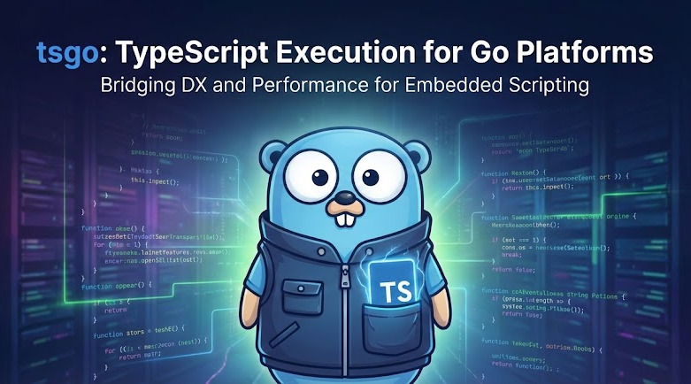
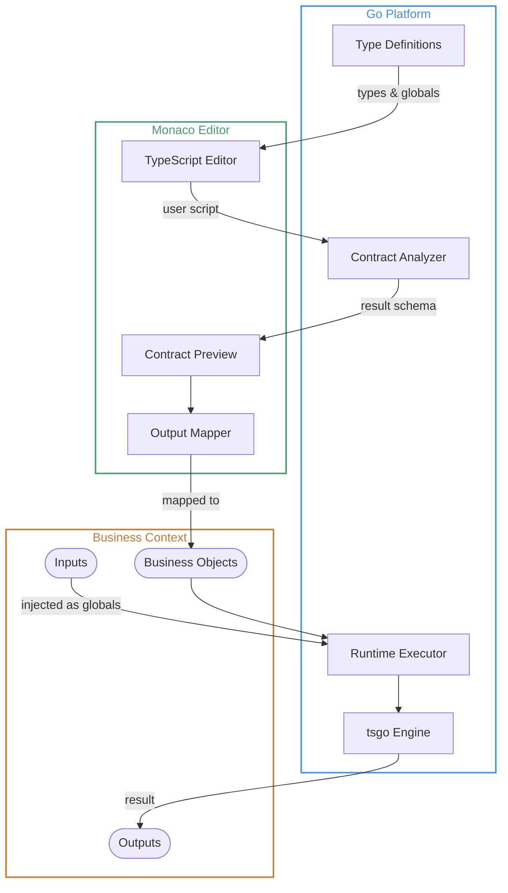
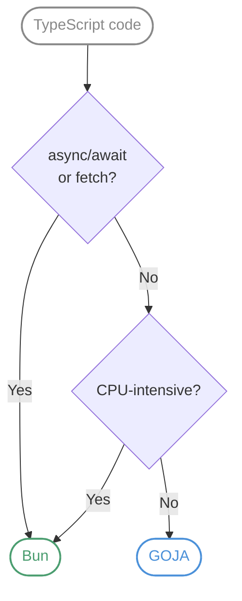

# tsgo

TypeScript execution library for Go for user-defined business logic embedding.



## Use Case: User-Defined Business Logic

tsgo enables **platforms** built in Go to safely execute **user-defined TypeScript** for customizable business logic - workflow conditions, automation handlers, data transformations, and more.



### How It Works

1. **Platform defines context** - The Go backend registers typed globals (e.g., `order: Order`, `user: User`) and interfaces that scripts can use
2. **User writes logic** - In the Monaco editor with full IntelliSense, autocomplete, and type checking powered by the platform's type definitions
3. **Contract extraction** - As the user types, the system analyzes the script and generates a contract (TypeScript types + JSON Schema) for the return value
4. **Output mapping** - The user maps the script's output to business objects (e.g., "route to → approval workflow", "set priority → field")
5. **Runtime execution** - When triggered, the Go backend executes the script with real data, returning typed, validated results

### Example: Order Routing Handler

```typescript
// Platform provides: order, customer, config (with full types)
const totalValue = order.items.reduce(
  (sum, item) => sum + item.price * item.quantity,
  0
);
const isVIP = customer.tier === "platinum" || customer.totalSpent > 100000;

// Business logic in TypeScript
const needsApproval = totalValue > config.approvalThreshold && !isVIP;
const priority = isVIP ? "high" : totalValue > 10000 ? "medium" : "normal";

export default {
  route: needsApproval ? "approval-workflow" : "fulfillment",
  priority,
  flags: {
    vipCustomer: isVIP,
    largeOrder: totalValue > 10000,
  },
};
```

**Generated Contract:**

```typescript
export type Result = {
  route: string;
  priority: string;
  flags: { vipCustomer: boolean; largeOrder: boolean };
};
```

The platform can then map `route` to a workflow selector, `priority` to a queue, and `flags` to audit fields - all with type safety and validation.

### Benefits

- **Type Safety** - Full TypeScript with platform-defined types eliminates runtime surprises
- **Great UX** - Monaco editor with IntelliSense gives users IDE-quality editing
- **Contract-Driven** - Output schemas enable visual mapping and validation before deployment
- **Secure Execution** - Sandboxed runtime with controlled globals, no file/network access
- **Pure Go Option** - GOJA engine requires no external prerequisites for simple scripts

## Features

- **Multiple Execution Engines**: GOJA (pure Go, zero prerequisites) and Bun (async/await, native TypeScript)
- **TypeScript Support**: Full TypeScript transpilation via esbuild
- **Automatic Engine Selection**: Analyzes code for async/await, fetch, etc. and routes to the appropriate engine
- **Security Sandboxing**: Validate code against restricted globals before execution
- **Monaco Integration**: Live TypeScript types for Monaco editor
- **Contract Generation**: Extract TypeScript types and JSON Schema from script exports
- **Source Map Support**: Error traces mapped back to original TypeScript line numbers
- **Execution Isolation**: Each execution gets a clean context-no state leakage between runs
- **Pooled Execution**: Pre-warmed runtime pools for both engines minimize latency
- **Process Crash Recovery**: Automatic retry with fresh Bun process on worker crashes
- **Debug Logging**: Optional structured logging for troubleshooting execution phases
- **Runtime Introspection**: Query executor state and statistics at runtime

## Installation

```bash
go get github.com/koltyakov/tsgo
```

## Quick Start

```go
package main

import (
  "context"
  "fmt"
  "time"

  "github.com/koltyakov/tsgo"
)

func main() {
  executor := tsgo.New(
    tsgo.WithEngine(tsgo.EngineGOJA),
    tsgo.WithTimeout(5*time.Second),
    tsgo.WithGlobals(map[string]any{
      "userId": 42,
    }),
  )
  defer executor.Close()

  result, err := executor.Execute(context.Background(), `
    const greeting: string = "Hello, User " + userId;
    export default greeting;
  `)
  if err != nil {
    panic(err)
  }

  fmt.Println(result.Value) // "Hello, User 42"
}
```

## Engines

| Engine | Pure Go | TypeScript  | Async/Await | Best For                                                  |
| ------ | ------- | ----------- | ----------- | --------------------------------------------------------- |
| GOJA   | ✅      | via esbuild | ❌          | High concurrency, simple expressions, pure Go deployments |
| Bun    | ❌      | Native      | ✅          | CPU-intensive work, async operations, complex TypeScript  |

### Engine Selection Guide



**GOJA** - Best for simple expressions, high concurrency, pure Go deployments  
**Bun** - Best for CPU-intensive work, async/await, complex TypeScript

See the [Benchmark Suite](internal/benchmark/README.md) for detailed comparison, cold start analysis, and performance data.

## Configuration Options

```go
executor := tsgo.New(
  tsgo.WithEngine(tsgo.EngineGOJA),      // Engine: EngineAuto (default), EngineGOJA, EngineBun
  tsgo.WithTimeout(10*time.Second),      // Execution timeout
  tsgo.WithGlobals(map[string]any{       // Global variables available to scripts
    "userId": 123,
    "config": map[string]any{"debug": true},
  }),
  tsgo.WithFunctions(map[string]tsgo.FunctionDef{  // Callable functions (see below)
    "sum": {TSCode: `function sum(a: number, b: number): number { return a + b; }`},
  }),
  tsgo.WithSecurity(tsgo.SecurityPolicy{
    RestrictedGlobals: []string{"eval", "Function"},  // Block dangerous globals
    AllowedGlobals:    []string{"fetch"},              // Explicit allowlist overrides
    NetworkAccess:     true,                            // Enable fetch/WebSocket in Bun
  }),
  tsgo.WithSourceMaps(true),             // Enable source map generation for error traces
  tsgo.WithPoolSize(4),                  // Worker pool size (default: NumCPU)
  tsgo.WithBackgroundWarmup(true),       // Start Bun processes in background (reduces init latency)
  tsgo.WithDebugLogger(logger),          // Enable debug logging (slog.Logger)
)
defer executor.Close()  // Always close to release resources
```

### Constructor Validation

`New(...)` validates config options immediately and panics if configuration is invalid
(for example, negative timeout/pool size values).

For non-panicking flows, use `NewWithError(...)`:

```go
executor, err := tsgo.NewWithError(
  tsgo.WithEngine(tsgo.EngineGOJA),
  tsgo.WithTimeout(10*time.Second),
)
if err != nil {
  return err // invalid configuration
}
defer executor.Close()
```

> **Note:** `SecurityPolicy` enforcement is limited to `RestrictedGlobals`/`AllowedGlobals` 
> checks and Bun `NetworkAccess` (for `fetch`/`WebSocket`).

### Security Policy Allowlist

`SecurityPolicy.AllowedGlobals` lets you opt-in to specific restricted globals
without weakening the default policy for everything else. This is useful for
explicitly enabling things like `fetch` in Bun-only samples.

```go
executor := tsgo.New(
  tsgo.WithSecurity(tsgo.SecurityPolicy{
    RestrictedGlobals: tsgo.DefaultSecurityPolicy().RestrictedGlobals,
    AllowedGlobals:    []string{"fetch", "process"},
    NetworkAccess:     true,
  }),
)
```

### Execution Metrics & Logs

`Result.Metrics` includes `TranspileTime` and `CacheHit` to help profile
TypeScript compilation overhead. For Bun executions, `Result.Logs` captures
`console.*` output from the worker (without corrupting the RPC channel).

```go
result, _ := executor.Execute(ctx, code)
fmt.Println(result.Metrics.TranspileTime, result.Metrics.CacheHit)
fmt.Println(result.Logs)
```

### Debug Logging

Enable structured debug logging to troubleshoot execution phases:

```go
logger := slog.New(slog.NewTextHandler(os.Stderr, &slog.HandlerOptions{
    Level: slog.LevelDebug,
}))

executor := tsgo.New(
    tsgo.WithDebugLogger(logger),
)
```

### Runtime Introspection

Query executor statistics for monitoring and debugging:

```go
stats := executor.Stats()

fmt.Printf("Engine configured: %v\n", stats.EngineConfigured)
fmt.Printf("GOJA active: %v\n", stats.GOJAActive)
fmt.Printf("Bun active: %v\n", stats.BunActive)
```

### Background Warmup (Bun Engine)

When using the Bun engine, you can reduce initialization latency from ~120ms to <1ms
by enabling background warmup:

```go
executor := tsgo.New(
    tsgo.WithEngine(tsgo.EngineBun),
    tsgo.WithBackgroundWarmup(true),  // Processes start in background goroutines
)
// New() returns immediately, first request may wait for process startup
```

This is ideal for services where fast startup is more important than immediate
readiness for the first request.

### Injecting Functions

Inject helper functions that scripts can call. Define once in TypeScript, works on all engines:

```go
executor := tsgo.New(
  tsgo.WithFunctions(map[string]tsgo.FunctionDef{
    // TSCode only (recommended) - works identically on GOJA and Bun
    "add": {
      TSCode: `function add(a: number, b: number): number { return a + b; }`,
    },
    "capitalize": {
      TSCode: `function capitalize(s: string): string {
        return s.charAt(0).toUpperCase() + s.slice(1).toLowerCase();
      }`,
    },

    // TSCode + GoFunc (performance optimization)
    // GOJA uses native Go function, Bun uses TSCode
    "sqrt": {
      TSCode: `function sqrt(x: number): number { return Math.sqrt(x); }`,
      GoFunc: math.Sqrt, // Optional: faster execution in GOJA
    },
  }),
)

// Scripts can now call these functions:
result, _ := executor.Execute(ctx, `
  const sum = add(10, 20);
  const title = capitalize("hello world");
  const root = sqrt(16);
  export default { sum, title, root };
`)
// Result: { sum: 30, title: "Hello world", root: 4 }
```

**Two approaches:**

| Approach            | TSCode      | GoFunc      | Use Case                         |
| ------------------- | ----------- | ----------- | -------------------------------- |
| **TSCode only**     | ✅ Required | ❌ Omit     | Simple functions, no duplication |
| **TSCode + GoFunc** | ✅ Required | ✅ Optional | Performance-critical GOJA code   |

For type-aware IntelliSense in Monaco, add function declarations to the type builder:

```go
builder := tsgo.NewTypeBuilder()
builder.AddFunction("add", "a: number, b: number", "number", "Adds two numbers")
builder.AddFunction("capitalize", "s: string", "string", "Capitalizes first letter")
```

See [cmd/functions](cmd/functions/main.go) for a complete example with various function types.

## Execution Isolation

tsgo provides **strong context isolation** between executions, making it safe for multi-tenant environments like BPMN engines where each process must be completely isolated.

### Isolation Guarantees

- **No Global State Leakage**: Variables set on `globalThis` in one execution are NOT visible to subsequent executions
- **Injected Globals Cleaned**: Globals passed via `WithGlobals()` are removed after each execution
- **Function Pollution Prevented**: Functions defined on `globalThis` are cleaned up
- **Warm Pool with Fresh Context**: Runtime pools are kept warm for performance while ensuring each execution gets a clean slate

### Example: Process Isolation

```go
executor := tsgo.New(
    tsgo.WithEngine(tsgo.EngineGOJA),
    tsgo.WithPoolSize(4),
)
defer executor.Close()

ctx := context.Background()

// Process A: Sets a "secret" value
executor.Execute(ctx, `globalThis.processASecret = "confidential"`)

// Process B: Cannot access Process A's data (returns undefined)
result, _ := executor.Execute(ctx, `typeof globalThis.processASecret`)
// result.Value == "undefined"
```

### How It Works

**GOJA Engine:**

- Tracks all globals set during execution (both injected and script-created)
- On release, scans `globalThis` and removes any properties not present in the base runtime
- Base runtime includes only safe defaults: `console`, `Object`, `Array`, `Math`, etc.

**Bun Engine:**

- Each execution creates a fresh `Function` scope
- Context is injected as local variables, not global state
- Process pool reuses worker processes, but execution contexts are isolated

This design allows high-performance pooled execution while maintaining strict isolation-critical for workflow engines, multi-tenant SaaS, and security-sensitive applications.

## Error Handling

### Source Map Error Mapping

When `WithSourceMaps(true)` is enabled, runtime errors are automatically mapped
back to original TypeScript line numbers:

```go
executor := tsgo.New(
    tsgo.WithSourceMaps(true),
)

_, err := executor.Execute(ctx, `
    function calculate() {
        throw new Error("Something went wrong");
    }
    calculate();
`)
// Error message will show TypeScript line numbers, not transpiled JavaScript
```

The `ExecutionError` type provides structured error information:

```go
if execErr, ok := err.(*tsgo.ExecutionError); ok {
    fmt.Println(execErr.Message)  // Error message
    fmt.Println(execErr.Stack)    // Stack trace (if available)
    // Original source location available when source maps enabled
}
```

### Process Crash Recovery (Bun Engine)

The Bun engine automatically recovers from worker process crashes:

- Detects process failures (broken pipe, unexpected EOF, etc.)
- Automatically retries execution with a fresh process
- Marks crashed processes for immediate recycling
- Provides clear error messages if retry also fails

This ensures resilience against Bun worker instability without manual intervention.

## Script Results Interpretation

tsgo extracts a single result value from each script execution. The result is determined using the following priority:

### 1. `export default` (Recommended)

The most explicit and recommended way to return a result:

```typescript
// Object export
export default { status: "success", count: 42 };

// Variable export
const result = computeValue();
export default result;

// Inline expression
export default items.filter((x) => x.active).length;
```

### 2. `export default function` / `async function`

When the default export is a function, tsgo automatically invokes it and returns the result:

```typescript
// Sync function - called automatically, returns "hello"
export default function () {
  return "hello";
}

// Arrow function - also called automatically
export default () => ({ computed: true, value: 123 });

// Async function - requires Bun engine (GOJA will error)
export default async (): Promise<string> => {
  const data = await fetchData();
  return data.result;
};
```

> **Note:** Async functions require the **Bun engine**. If you use `EngineAuto` (default), async code is automatically routed to Bun. If you explicitly select GOJA for async code, you'll receive a clear error message.

### 3. Last Expression (Implicit)

For simple scripts without exports, the last expression's value is returned:

```typescript
// Simple expression - returns 15
const x = 10;
const y = 5;
x + y;

// Comparison - returns true
const a = 5;
const b = 3;
a > b;

// Object literal - returns the object
const name = "test";
({ name, timestamp: Date.now() });
```

> **Note:** The last expression must be a valid JavaScript expression (not a statement). Wrapping object literals in parentheses `({...})` ensures they're treated as expressions.

### Priority Summary

| Pattern                | Priority | Use Case                  |
| ---------------------- | -------- | ------------------------- |
| `export default value` | 1st      | Explicit static values    |
| `export default fn()`  | 1st      | Functions auto-invoked    |
| Last expression        | 2nd      | Quick scripts, REPL-style |

## Contract Generation

Extract TypeScript type definitions and JSON Schema from scripts for validation, form generation, or API documentation:

```go
code := `
  interface User {
    id: number;
    name: string;
    email?: string;
  }
  const user: User = { id: 1, name: "Alice" };
  export default user;
`

// Analyze the script to extract the contract
contract, err := tsgo.AnalyzeContract(code)
if err != nil {
  panic(err)
}

// Generate TypeScript type definition
ts := contract.ToTypeScript()
// Output:
// export type Result = {
//   id: number;
//   name: string;
//   email?: string;
// };

// Generate JSON Schema for validation/forms
jsonSchema, _ := contract.ToJSONSchemaJSON()
// Output: JSON Schema 2020-12 with properties, types, required fields

// Get full contract as JSON for external systems
contractJSON, _ := contract.ToJSON()
```

The `Contract` struct includes:

- **Name** - Contract identifier (usually "Result")
- **Type** - Full type definition tree (object, array, union, primitives)
- **Inputs** - Declared global variables the script expects (`declare const ...`)

Output methods:

- `ToTypeScript()` - Returns `.d.ts` compatible type definitions
- `ToJSONSchema()` - Returns `*JSONSchema` struct
- `ToJSONSchemaJSON()` - Returns JSON Schema 2020-12 as `[]byte`
- `ToJSON()` - Returns full contract as JSON `[]byte`

## Monaco Integration

The Monaco handler provides WebSocket-based integration for live TypeScript type updates:

```go
package main

import (
  "log"
  "net/http"

  "github.com/koltyakov/tsgo"
)

func main() {
  // Create Monaco handler for WebSocket communication
  handler := tsgo.NewMonacoHandler()

  // Build TypeScript type definitions
  builder := tsgo.NewTypeBuilder()
  builder.AddInterface("User", map[string]string{
    "id":    "number",
    "name":  "string",
    "email": "string",
    "role":  "'admin' | 'user' | 'guest'",
  })
  builder.AddInterface("Config", map[string]string{
    "apiUrl":  "string",
    "timeout": "number",
    "debug":   "boolean",
  })
  builder.AddGlobal("currentUser", "User")
  builder.AddGlobal("config", "Config")
  builder.AddFunction("sum", "x: number, y: number", "number", "Adds two numbers")

  // Apply types to handler (broadcasts to connected clients)
  handler.SetTypes(builder)

  // Handler serves: /ws (WebSocket), /types (GET), /client.js
  http.Handle("/api/", handler)

  log.Fatal(http.ListenAndServe(":8080", nil))
}
```

The handler provides:

- `/ws` - WebSocket endpoint for real-time type updates
- `/types` - GET endpoint returning current `.d.ts` definitions
- `/client.js` - Client-side integration script

## Monaco Playground Demo

The project includes a fully-featured Monaco editor playground for testing TypeScript execution:

```bash
# Run the playground (opens http://localhost:8080)
make monaco

# Or directly with Go
go run ./cmd/monaco
```


### Features

- **Live TypeScript editing** with full IntelliSense and autocomplete
- **Engine selection** - Auto (recommended), GOJA, or Bun
- **Real-time contract generation** - see TypeScript types and JSON Schema as you type
- **Sample code library** - multiple examples demonstrating different use cases
- **Context-aware execution** - each sample has its own type definitions and globals
- **GOJA compatibility warnings** - errors shown when using unsupported features (async/await, fetch, etc.)
- **Persistent code** - your code is saved to localStorage automatically
- **Keyboard shortcut** - Press `⌘+Enter` (Mac) or `Ctrl+Enter` (Windows/Linux) to run

### Sample-Provided Context

Each sample in the demo provides its own typed context. For example, the "Basic Types" sample provides:

```typescript
// Types defined in context
interface User {
  id: number;
  name: string;
  email: string;
  role: "admin" | "user" | "guest";
}

interface Config {
  apiUrl: string;
  timeout: number;
  debug: boolean;
}

// Globals available in your script
const currentUser: User;
const config: Config;

// Functions available
function sum(x: number, y: number): number;
function multiply(x: number, y: number): number;
```

## License

MIT
