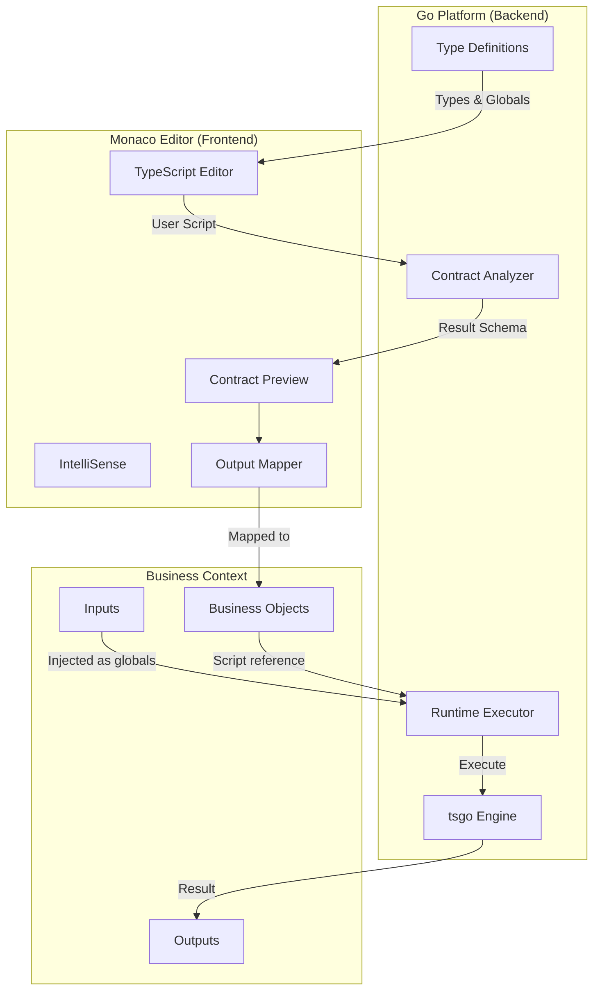
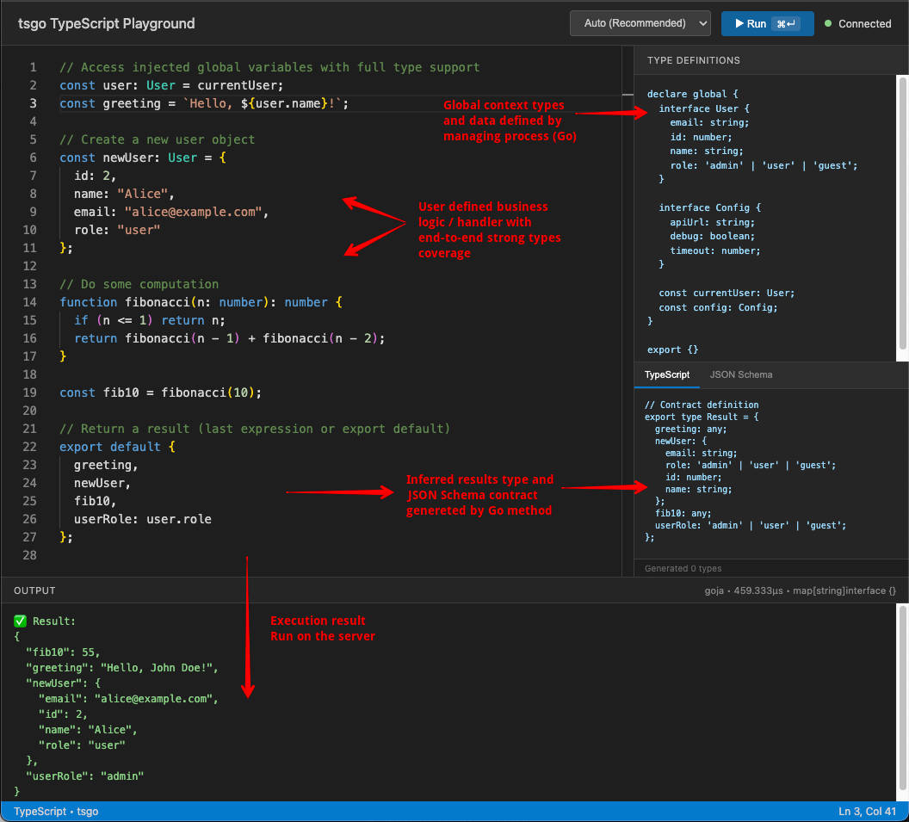

# tsgo

TypeScript execution library for Go for user-defined business logic embedding.

## Use Case: User-Defined Business Logic

tsgo enables **platforms** built in Go to safely execute **user-defined TypeScript** for customizable business logic — workflow conditions, automation handlers, data transformations, and more.



### How It Works

1. **Platform defines context** — The Go backend registers typed globals (e.g., `order: Order`, `user: User`) and interfaces that scripts can use
2. **User writes logic** — In the Monaco editor with full IntelliSense, autocomplete, and type checking powered by the platform's type definitions
3. **Contract extraction** — As the user types, the system analyzes the script and generates a contract (TypeScript types + JSON Schema) for the return value
4. **Output mapping** — The user maps the script's output to business objects (e.g., "route to → approval workflow", "set priority → field")
5. **Runtime execution** — When triggered, the Go backend executes the script with real data, returning typed, validated results

### Example: Order Routing Handler

```typescript
// Platform provides: order, customer, config (with full types)
const totalValue = order.items.reduce((sum, item) => sum + item.price * item.quantity, 0);
const isVIP = customer.tier === 'platinum' || customer.totalSpent > 100000;

// Business logic in TypeScript
const needsApproval = totalValue > config.approvalThreshold && !isVIP;
const priority = isVIP ? 'high' : totalValue > 10000 ? 'medium' : 'normal';

export default {
  route: needsApproval ? 'approval-workflow' : 'fulfillment',
  priority,
  flags: {
    vipCustomer: isVIP,
    largeOrder: totalValue > 10000,
  }
};
```

**Generated Contract:**
```typescript
export type Result = {
  route: string;
  priority: string;
  flags: { vipCustomer: boolean; largeOrder: boolean };
};
```

The platform can then map `route` to a workflow selector, `priority` to a queue, and `flags` to audit fields — all with type safety and validation.

### Benefits

- **Type Safety** — Full TypeScript with platform-defined types eliminates runtime surprises
- **Great UX** — Monaco editor with IntelliSense gives users IDE-quality editing
- **Contract-Driven** — Output schemas enable visual mapping and validation before deployment
- **Secure Execution** — Sandboxed runtime with controlled globals, no file/network access
- **Pure Go Option** — GOJA engine requires no external dependencies for simple scripts

## Features

- **Multiple Execution Engines**: GOJA (pure Go), Bun (requires installation)
- **TypeScript Support**: Full TypeScript transpilation via esbuild
- **Automatic Engine Selection**: Chooses the best engine based on code analysis
- **Security Sandboxing**: Restrict globals, file access, and network operations
- **Monaco Integration**: Live TypeScript types for Monaco editor
- **Source Map Support**: Error traces mapped to original TypeScript

## Installation

```bash
go get github.com/koltyakov/tsgo
```

## Quick Start

```go
package main

import (
  "context"
  "fmt"
  "time"

  "github.com/koltyakov/tsgo"
)

func main() {
  executor := tsgo.New(
    tsgo.WithEngine(tsgo.EngineGOJA),
    tsgo.WithTimeout(5*time.Second),
    tsgo.WithGlobals(map[string]any{
      "userId": 42,
    }),
  )
  defer executor.Close()

  result, err := executor.Execute(context.Background(), `
    const greeting: string = "Hello, User " + userId;
    export default greeting;
  `)
  if err != nil {
    panic(err)
  }
  
  fmt.Println(result.Value) // "Hello, User 42"
}
```

## Engines

| Engine | Pure Go | TypeScript | Async | Network |
|--------|---------|------------|-------|---------|
| GOJA   | ✅      | via esbuild| ❌    | ❌      |
| Bun    | ❌      | Native     | ✅    | ✅      |

### Engine Selection Guide

```
┌─────────────────────────────────────────────────────────────┐
│                    Need async/await?                        │
└─────────────────────────────────────────────────────────────┘
                          │
              ┌───────────┴───────────┐
              │                       │
             Yes                      No
              │                       │
              ▼                       ▼
        ┌─────────┐         ┌─────────────────────┐
        │   Bun   │         │ CPU-intensive work? │
        └─────────┘         └─────────────────────┘
                                      │
                          ┌───────────┴───────────┐
                          │                       │
                         Yes                      No
                          │                       │
                          ▼                       ▼
                    ┌─────────┐             ┌─────────┐
                    │   Bun   │             │  GOJA   │
                    └─────────┘             └─────────┘
```

**GOJA** - Best for simple expressions, high concurrency, pure Go deployments  
**Bun** - Best for CPU-intensive work, async/await, complex TypeScript

See the [Benchmark Suite](internal/benchmark/README.md) for detailed comparison, cold start analysis, and performance data.

## Configuration Options

```go
tsgo.New(
  tsgo.WithEngine(tsgo.EngineGOJA),      // Engine selection
  tsgo.WithTimeout(10*time.Second),      // Execution timeout
  tsgo.WithMemoryLimit(64*1024*1024),    // Memory limit (64MB)
  tsgo.WithGlobals(map[string]any{...}), // Global variables
  tsgo.WithFunctions(map[string]tsgo.FunctionDef{...}), // Helper functions
  tsgo.WithSecurity(tsgo.SecurityPolicy{
    RestrictedGlobals: []string{"eval", "Function"},
  }),
  tsgo.WithSourceMaps(true),             // Enable source maps
  tsgo.WithPoolSize(4),                  // Worker pool size
)
```

### Injecting Functions

You can inject Go functions that scripts can call. Each function requires both a Go implementation (for GOJA) and TypeScript code (for Bun):

```go
executor := tsgo.New(
  tsgo.WithFunctions(map[string]tsgo.FunctionDef{
    "sum": {
      GoFunc: func(x, y float64) float64 { return x + y },
      TSCode: "function sum(x, y) { return x + y; }",
    },
    "greet": {
      GoFunc: func(name string) string { return "Hello, " + name },
      TSCode: "function greet(name) { return 'Hello, ' + name; }",
    },
  }),
)

// Scripts can now call these functions:
result, _ := executor.Execute(ctx, `export default sum(10, 20)`) // 30
```

For type-aware IntelliSense in Monaco, add function declarations to the type builder:

```go
builder := typegen.NewBuilder()
builder.AddFunction("sum", "x: number, y: number", "number", "Adds two numbers")
```

## Execution Isolation

tsgo provides **strong context isolation** between executions, making it safe for multi-tenant environments like BPMN engines where each process must be completely isolated.

### Isolation Guarantees

- **No Global State Leakage**: Variables set on `globalThis` in one execution are NOT visible to subsequent executions
- **Injected Globals Cleaned**: Globals passed via `WithGlobals()` are removed after each execution  
- **Function Pollution Prevented**: Functions defined on `globalThis` are cleaned up
- **Warm Pool with Fresh Context**: Runtime pools are kept warm for performance while ensuring each execution gets a clean slate

### Example: Process Isolation

```go
executor := tsgo.New(
    tsgo.WithEngine(tsgo.EngineGOJA),
    tsgo.WithPoolSize(4),
)
defer executor.Close()

ctx := context.Background()

// Process A: Sets a "secret" value
executor.Execute(ctx, `globalThis.processASecret = "confidential"`)

// Process B: Cannot access Process A's data (returns undefined)
result, _ := executor.Execute(ctx, `typeof globalThis.processASecret`)
// result.Value == "undefined"
```

### How It Works

**GOJA Engine:**
- Tracks all globals set during execution (both injected and script-created)
- On release, scans `globalThis` and removes any properties not present in the base runtime
- Base runtime includes only safe defaults: `console`, `Object`, `Array`, `Math`, etc.

**Bun Engine:**
- Each execution creates a fresh `Function` scope
- Context is injected as local variables, not global state
- Process pool reuses worker processes, but execution contexts are isolated

This design allows high-performance pooled execution while maintaining strict isolation—critical for workflow engines, multi-tenant SaaS, and security-sensitive applications.

## Script Results Interpretation

tsgo extracts a single result value from each script execution. The result is determined using the following priority:

### 1. `export default` (Recommended)

The most explicit and recommended way to return a result:

```typescript
// Object export
export default { status: 'success', count: 42 };

// Variable export
const result = computeValue();
export default result;

// Inline expression
export default items.filter(x => x.active).length;
```

### 2. `export default function` / `async function`

When the default export is a function, tsgo automatically invokes it and returns the result:

```typescript
// Sync function — called automatically, returns "hello"
export default function() {
  return "hello";
}

// Arrow function — also called automatically
export default () => ({ computed: true, value: 123 });

// Async function — requires Bun engine (GOJA will error)
export default async (): Promise<string> => {
  const data = await fetchData();
  return data.result;
};
```

> **Note:** Async functions require the **Bun engine**. If you use `EngineAuto` (default), async code is automatically routed to Bun. If you explicitly select GOJA for async code, you'll receive a clear error message.

### 3. Last Expression (Implicit)

For simple scripts without exports, the last expression's value is returned:

```typescript
// Simple expression — returns 15
const x = 10;
const y = 5;
x + y

// Comparison — returns true
const a = 5;
const b = 3;
a > b

// Object literal — returns the object
const name = "test";
({ name, timestamp: Date.now() })
```

> **Note:** The last expression must be a valid JavaScript expression (not a statement). Wrapping object literals in parentheses `({...})` ensures they're treated as expressions.

### Priority Summary

| Pattern | Priority | Use Case |
|---------|----------|----------|
| `export default value` | 1st | Explicit static values |
| `export default fn()` | 1st | Functions auto-invoked |
| Last expression | 2nd | Quick scripts, REPL-style |


## Contract Generation

Extract TypeScript type definitions and JSON Schema from scripts for mapping, validation, or form generation:

```go
code := `
  interface User {
    id: number;
    name: string;
    email?: string;
  }
  const user: User = { id: 1, name: "Alice" };
  export default user;
`

// Analyze the script to extract the contract
contract, err := tsgo.AnalyzeContract(code)
if err != nil {
  panic(err)
}

// Generate TypeScript type definition
ts := contract.ToTypeScript()
// Output:
// export type Result = { id: number; name: string; email?: string };

// Generate JSON Schema for validation/forms
schema := contract.ToJSONSchema()
jsonSchema, _ := contract.ToJSONSchemaJSON()
// Output: JSON Schema 2020-12 with properties, types, required fields

// Get contract as JSON for external systems
contractJSON, _ := contract.ToJSON()
```

The contract includes:
- **Type** - Full type definition of the default export (object, array, union, primitives)
- **Inputs** - Declared global variables the script expects (`declare const ...`)
- **TypeScript** - Generated `.d.ts` compatible type definitions
- **JSON Schema** - Schema for validation, form builders, or API documentation

## Monaco Integration

```go
handler := tsgo.NewMonacoHandler()

builder := tsgo.NewTypeBuilder()
builder.AddInterface("User", map[string]string{
  "id":   "number",
  "name": "string",
})
builder.AddGlobal("currentUser", "User")

handler.SetTypes(builder)

http.Handle("/", handler)
http.ListenAndServe(":8080", nil)
```

## Monaco Playground Demo

The project includes a fully-featured Monaco editor playground for testing TypeScript execution:

```bash
# Run the playground
make monaco

# Or directly with Go
go run ./cmd/monaco
```

Then open http://localhost:8080 in your browser.



### Features

- **Live TypeScript editing** with full IntelliSense and autocomplete
- **Engine selection** — Auto (recommended), GOJA, or Bun
- **Real-time contract generation** — see TypeScript types and JSON Schema as you type
- **GOJA compatibility warnings** — errors shown when using unsupported features (async/await, fetch, etc.)
- **Persistent code** — your code is saved to localStorage automatically
- **Keyboard shortcut** — Press `⌘+Enter` (Mac) or `Ctrl+Enter` (Windows/Linux) to run

### Injected Globals

The demo provides typed globals you can use in your scripts:

```typescript
// Available globals with full type support
const user: User = currentUser;  // { id, name, email, role }
const cfg: Config = config;      // { apiUrl, timeout, debug }
```

### Injected Functions

The demo also provides helper functions that work in both GOJA and Bun:

```typescript
// Available functions with full type support
const total = sum(10, 20);       // 30
const product = multiply(5, 6);  // 30
```

## Project Structure

```
github.com/koltyakov/tsgo
├── tsgo.go                 # Public API and executor
├── internal/
│   ├── types/              # Core types and interfaces
│   ├── engine/             # Execution engines
│   │   ├── goja/           # GOJA engine (pure Go, sync only)
│   │   └── bun/            # Bun engine (async, network capable)
│   ├── transpiler/         # TypeScript → JavaScript (esbuild)
│   ├── selector/           # Automatic engine selection
│   ├── sandbox/            # Security sandboxing
│   ├── sourcemap/          # Source map handling
│   ├── typegen/            # Type definition generation
│   ├── contract/           # Contract extraction & JSON Schema
│   ├── monaco/             # Monaco editor integration
│   └── benchmark/          # Performance benchmarks
└── cmd/
    ├── basic/              # Basic usage example
    ├── monaco/             # Monaco playground demo
    └── benchmark/          # Benchmark runner
```

## License

MIT